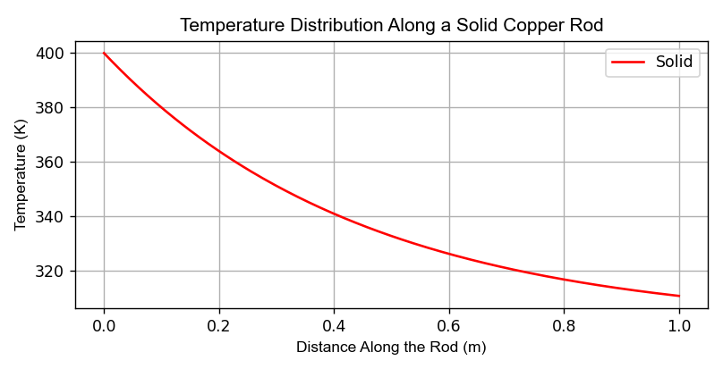
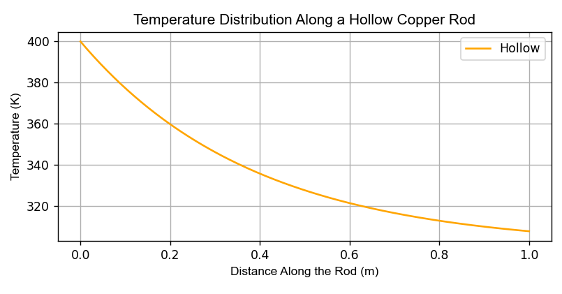

# Heat Conduction in a Cylindrical Rod

This project analyzes temperature distribution in a cylindrical rod with heat loss to the surroundings.

## Physics Background
The model is based on:
- Fourier’s Law of Heat Conduction
- Newton’s Law of Cooling

This leads to an exponential decay of temperature along the rod.

## Computational Model
A Python simulation was built to:
- Solve the governing equation
- Visualize temperature distribution
- Study parameter effects

## Output

## Tools Used
- Python
- NumPy
- Matplotlib
